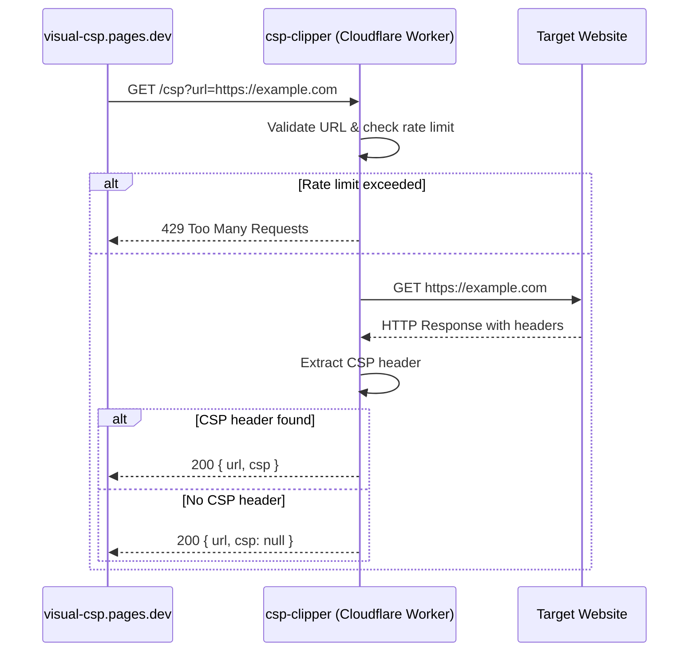

# csp-clipper

Cloudflare Worker that fetches the `Content-Security-Policy` header from any URL and returns it as JSON. Built to power [visual-csp.pages.dev](https://visual-csp.pages.dev).

## How it works



## API

### `GET /csp?url=<target>`

| Parameter | Description |
|-----------|-------------|
| `url` | Required. Absolute HTTP or HTTPS URL to fetch the CSP header from. |

### Response

```json
{
  "url": "https://example.com",
  "csp": "default-src 'self'; script-src 'none'"
}
```

When no CSP header is found:

```json
{
  "url": "https://example.com",
  "csp": null,
  "message": "No CSP header found"
}
```

### Rate Limiting

Requests are limited to **30 per minute** per IP. Rate limit info is included in response headers:

| Header | Description |
|--------|-------------|
| `X-RateLimit-Limit` | Maximum requests per window |
| `X-RateLimit-Remaining` | Remaining requests in current window |
| `X-RateLimit-Reset` | Unix timestamp when the window resets |

### CORS

Only requests from `https://visual-csp.pages.dev` are allowed.

## Development

```bash
npm install
npm run dev       # Start local dev server on localhost:8787
npm test          # Run unit tests
```

## Deploy

```bash
npm run deploy
```
